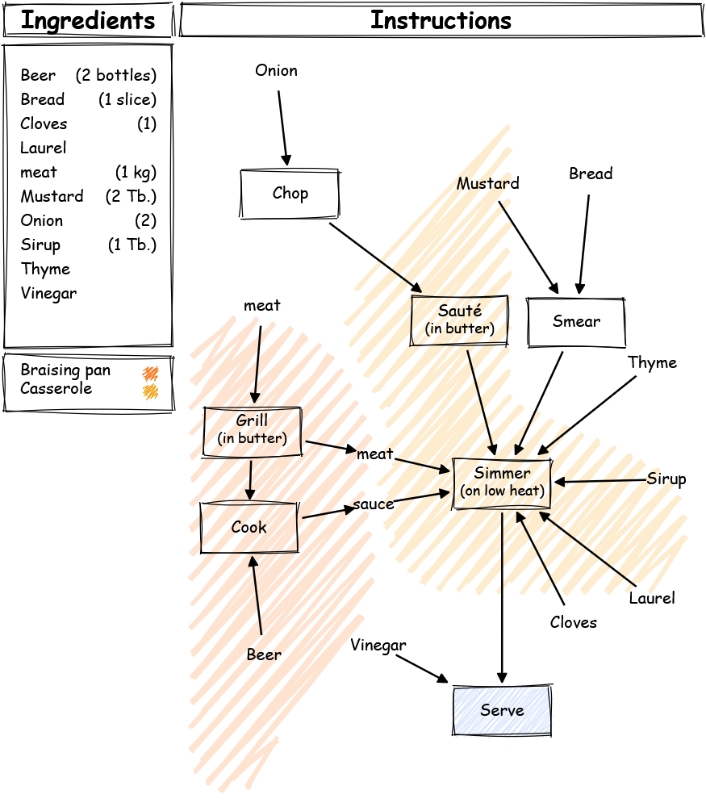

import RecipeFlowchart from "./RecipeFlowchart.astro";

Building on the idea that [recipes should be flowcharts](/blog/06-flowchart-recipes), this post explores how to convert traditional text-based recipes into clear, visual flowcharts.
Using D3.js, a node network is generated from a recipe. The process steps and ingredients are dragable for flexibility and clarity.

Fill in your recipe in the text box and click <kbd>Generate Flowchart</kbd>. 
Two example recipes are added below to showcase the recipe syntax and a possible final image *(lightmode only)* after (re)organizing the flowchart. 
Feel free to copy the recipes in the recipe text box to see what happens.

After generating the initial recipe flowchart. You can drag around the nodes to obtain a logical order and to avoid overlaps of links between nodes. This process requires some artistic input from the user (for now ...).
*The flowchart adapts to light/dark mode, but was designed for light mode first.* 

<RecipeFlowchart />

## Recipe syntax[^1]

These examples are based on the recipes from [the previous post on the topic](/blog/06-flowchart-recipes). 

*The generated images are not optimized for dark mode as the exporter (currently) only supports light mode exporting for printing purposes.*

### Flemish beef stew
```python
Subprocess Grill {
    Add meat {1 kg}
    Grill (in butter) in Braising pan
    Out meat
    Add Beer {2 bottles}
    Cook in Braising pan
    Out sauce
}

Subprocess Bread {
    Add Bread {1 slice}
    Add Mustard {2 Tb.}
    Smear
    Out .
}

Add Onion {2}
Chop
Sauté (in butter) in Casserole
Add meat from Grill
Add sauce from Grill
Add Laurel
Add Thyme
Add Cloves {1}
Add Sirup {1 Tb.}
Add . from Bread
Simmer (on low heat) in Casserole
Add Vinegar
Out
```



### Brussels Wafels
```python
Subprocess A {
    Add egg {1}
    Separate
    Out White
    Out Yolk
}

Subprocess B {
    Add White from A
    Beat It (1983) in Mixing bowl 2
    Out .
}

Subprocess C {
    Add Butter {50 g}
    Melt
    Out .
}

Add Yolk from A
Add Yeast {6 g}
Add Milk {125 g}
Add Water {125 g}
Mix in Mixing bowl 1
Add Flour {150 g}
Add . from C
Mix in Mixing bowl 1
Add . from B
Mix (Carefully) in Mixing bowl 1
Bake
Out
```


[^1]: Yes, this is a custom programming language.